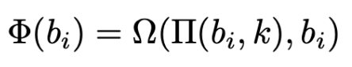

# CictroKDF

### Description:

The flag is encrypted and then base64'd. Here it is: E2zVOQfaRwYoMiTapzA03RQJJmtq1KuHTCuWGdVo/+w=

To decrypt it you will need to implement the amazing Key Derivation Function called CictroKDF (not to be confused with the well-known CictroHash). After a key has been derived you can use it with AES ECB mode to decrypt the flag.

The message for the KDF is: Are you silly? I'm still gunna send it!!

Wrap the flag in RITSEC{}

Author: cictrone

### Hints:

Hint: example setup Key: "Totally not a black box, I swear" Plaintext: "not a black box!" Ciphertext (base64'ed): GywB/y8LEXN335lUf6QWzA==

Hint2: pi_func(ord('a'), 0) = 42 pi_func(pi_func(ord('a'), 0), 1) = 70 pi_func(ord('b'), 0) = 46 pi_func(pi_func(ord('b'), 0), 1) = 228 pi_func(ord('d'), 0) = 136 pi_func(pi_func(ord('d'), 0), 1) = 92 pi_func(ord('d'), 50) = 168 pi_func(pi_func(ord('d'), 50), 25) = 94

### Solution:

So basically you just had to implement the Key Derivation Function which was specified in the PDF Document.

Once that is done, you simply derive a key from the secret text and decrypt the provided base64 data with AES128 in ECB Mode.

Though the actual challenge seemed to be how to figure out what was actually meant by the pseudo mathematical definitions. Because they were confusing and accurate we didn't manage to solve this in time.

Two key errors we made during this were:
1. in pi_func every bit should be changed based on the original byte value, NOT the already permuted bits.
2. similar thing in the phi function, the first `bi` value is supposed to change every round and the second `bi` is always supposed to be the original value.

Another fun fact, because (i mod 4)th slot in the state array simply gets replaced every round means that only the last 4 bytes of the initial message are significant for the derived key.

The secret text `Are you silly? I'm still gunna send it!!` works as well as `it!!`.

The full implementation can be found in cictroKDF.py

Flag: RITSEC{i am a person who dos the crypto}
